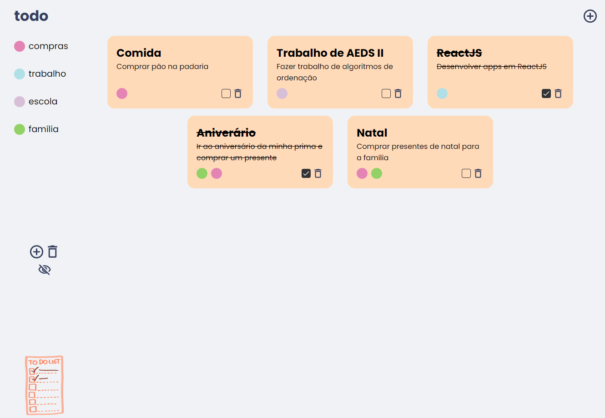

    <a href="#inicializar">Inicializar</a>&nbsp;&nbsp;&nbsp;|&nbsp;&nbsp;&nbsp;
    <a href="#descricao">Descrição</a>&nbsp;&nbsp;&nbsp;|&nbsp;&nbsp;&nbsp;
    <a href="#funcionalidades">Funcionalidades</a>&nbsp;&nbsp;&nbsp;|&nbsp;&nbsp;&nbsp;
    <a href="#contribuidores">Contribuidores</a>

  

    

<h3 align="center">
      
</h3>

 
<h2 id="inicializar">Inicializar projeto</h2> Para começar o projeto execute o comando yarn install depois yarn start.
<h2 id="descricao">Descrição</h2>

 Projeto de uma lista de tarefas, pelo qual é possível criar e excluir tarefas, adicionar e remover
tags, além de um filtro para mostrar ou não as tarefas que estão marcadas como feitas.

Este é um projeto totalmente desenvolvido em ReactJS, com o intuito de estudo.

<h4>Status do projeto: ✅Finalizado.</h4>

<h2 id="funcionalidades">Funcionalidades</h2>

<ul>
  <li>
    <h4>Adicionar tasks</h4>
    
  </li>
  <li>
    <h4>Excluir tasks e marcar como feita</h4>
    
  </li>
  <li>
    <h4>Adicionar e excluir tags</h4>
    
  </li>
  <li>
    <h4>Filtrar tasks já feitas</h4>
    
  </li>
</ul>

<h2 id="contribuidores">Contribuidores</h2>
<table>
  <tr>
    <td align="center">
      <a href="https://github.com/davidsonmarra">
         
        
          <b>Davidson Marra</b>
        
      </a>
    </td>
    <td align="center">
      <a href="https://github.com/phtsouza">
         
        
          <b>Pedro Teixeira</b>
        
      </a>
    </td>
  </tr>
</table>
